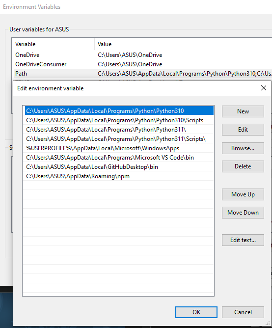
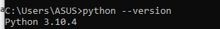
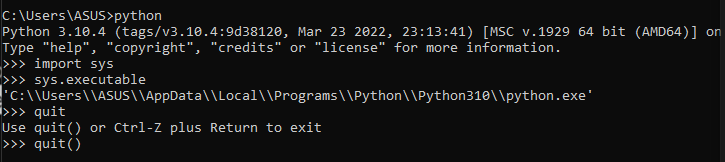
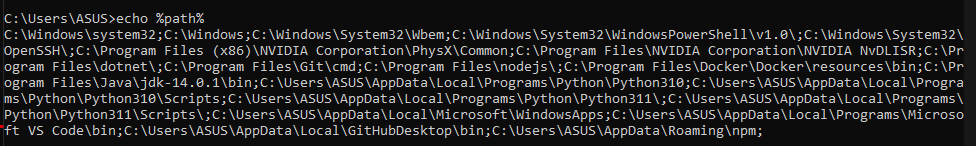
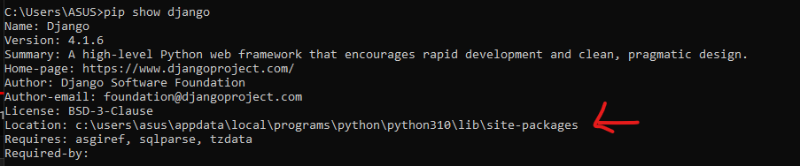
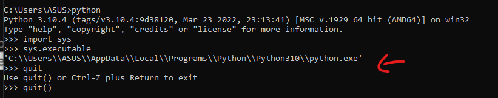

# Set path and Switch Between Different Version (WINDOW)

# STEP 1 : INSTALL PYTHON VERSION you want to download

[Welcome to Python.org](https://www.python.org/)

you can run the python file directly in the command line by typing

```bash
> C:\Users\ASUS\AppData\Local\Programs\Python\Python310\python
```

Go to environment variable > User variable > Path





because the python 310 is above python 311

Scripts - is to run pip.exe

```bash
> python # go to python shell
import sys
sys.executable # to konw which python is running
quit()
```



```bash
echo %path% #all the path
```



when cannot import django

```bash
you need to use
pip show django
then the folder must be same as the sys.executable
```




