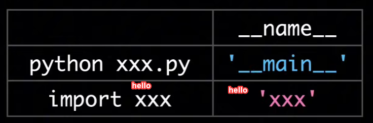

1. cd \_\_main\_\_
2. Run `python3 hello.py` to see the output.

```python
Output:
__main__
Hello, World!
```

3. Run `python3 main.py -h` to see the output.

```python
Output:
hello #package nmae
Being imported
This is main.py
```



4. Run `python3 thread.py` to see the output.

```python
Processing 0
Processing 1
Processing 3
Processing 2
Processing 4
[0, 1, 4, 9, 16]

```

Note: If you do not put if \_\_name\_\_ == "\_\_main\_\_": in the code, then the code create 5 threads and each of the new thread will create another 5 threads and so on. This will create a lot of threads and the program will crash.

But if you put if \_\_name\_\_ == "\_\_main\_\_": in the code, then the code will create 5 threads only in the main/first thread and run them and then the program will stop.
